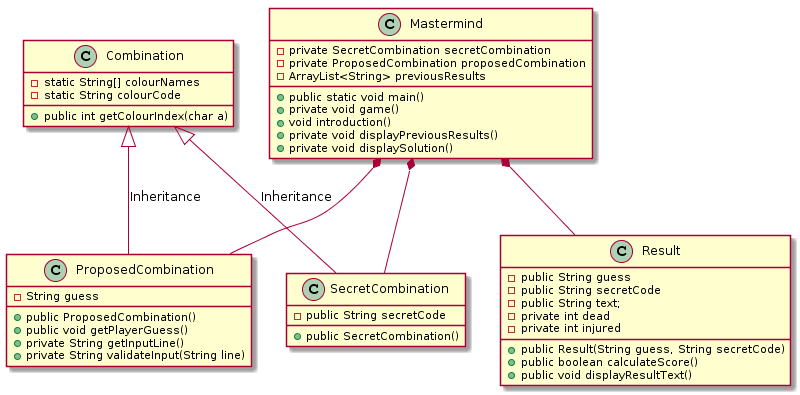

= Mastermind

Game based on the https://en.wikipedia.org/wiki/Mastermind_(board_game)[Mastermind game].

== Rules

* A player chooses 4 colours (more in a future. Maybe)
* Colours: r b y g o p red blue yellow green orange purple
* Not repeated
* Dead (black) Same colour, same position
* Injured (white) Same colour, different position
* You with 10 tries

== Versions
What have been done in each version of the game.

=== Version 1.0.0 

https://github.com/reymon359/java-mastermind/tree/b494c53a5fe2764c3e48ff4015abbed73c2952fa[Browse Version 1.0.0 files on Github]

The game is playable, playable meaning you can start, try your combinations and if it is the secret one, win the game.

*Console output:*

----
Colour Code : rbygop
Enter your guess : rbgy
Guess: [red, blue, green, yellow] injured is 2   dead is 1
Colour Code : rbygop
Enter your guess : aaaaa
Must enter 4 letters
Colour Code : rbygop
Enter your guess : abab
Invalid Colour
.
.
.
Colour Code : rbygop
Enter your guess : oprb
Guess: [orange, purple, red, blue] injured is 3   dead is 3
Colour Code : rbygop
Enter your guess : opry
Guess: [orange, purple, red, yellow] injured is 4   dead is 4
Good Job! The solution is : 
[orange, purple, red, yellow]

----

*Structure*

The game is just one single class that contains all the attributes and methods of the game.

.Version 1.0.0 Structure
image::./Sources/version1.0.0.png[Class diagram Version 1.0.0]

*About this version*

Although the game is playable and you can complete a match there are some things wrong:

* There is no trying limit, when it should be 10.
* The structure of just one class is not the suitable because it is hard to read and understand the whole game. It should be done with more classes that interact with each others.
* The game does not show the precious combinations in the window, it just shows the last combination.
* There should be some kind of replayability

=== Version 1.1.0 

https://github.com/reymon359/java-mastermind/tree/bc825e98d636bbc35f7ea0e1ad717a3b445fdaad[Browse Version 1.1.0 files on Github]

The game is still playable and new functionalities have been added:

* Now there is a limit of guesses, 10.
* There is an Introduction to the game that presents and explains the game.
* The structure is now divided in clases after *abstracting* the stuff related and creating new classes.
* The game also shows the user the previous guesses.

*Console output:*

----
Welcome to Mastermind.
You can guess the secret combination 10 times.
Good luck!
Colour Code : rbygop
Enter your guess : rygb
Guess 1 : [red, yellow, green, blue] Injureds: 3, deads: 0
Colour Code : rbygop
The previous results are: 
Guess 1 : [red, yellow, green, blue] Injureds: 3, deads: 0

Enter your guess : rrrr
Guess 2 : [red, red, red, red] Injureds: 0, deads: 0
Colour Code : rbygop
The previous results are: 
Guess 1 : [red, yellow, green, blue] Injureds: 3, deads: 0
Guess 2 : [red, red, red, red] Injureds: 0, deads: 0

Enter your guess : ygbr
Guess 3 : [yellow, green, blue, red] Injureds: 3, deads: 3
Colour Code : rbygop
The previous results are: 
Guess 1 : [red, yellow, green, blue] Injureds: 3, deads: 0
Guess 2 : [red, red, red, red] Injureds: 0, deads: 0
Guess 3 : [yellow, green, blue, red] Injureds: 3, deads: 3

Enter your guess : ygbo
Guess 4 : [yellow, green, blue, orange] Injureds: 3, deads: 3
Colour Code : rbygop
The previous results are: 
Guess 1 : [red, yellow, green, blue] Injureds: 3, deads: 0
Guess 2 : [red, red, red, red] Injureds: 0, deads: 0
Guess 3 : [yellow, green, blue, red] Injureds: 3, deads: 3
Guess 4 : [yellow, green, blue, orange] Injureds: 3, deads: 3

Enter your guess : ygbp
Guess 5 : [yellow, green, blue, purple] Injureds: 4, deads: 4
Good Job! The solution is : 
[yellow, green, blue, purple]

----

Game over. If you pass the guess limit.

----
Guess 9 : [red, red, red, red] Injureds: 4, deads: 1

Enter your guess : rrrr
Guess 10 : [red, red, red, red] Injureds: 4, deads: 1
GAME OVER! The solution was: 
[red, purple, green, blue]

----

*Structure*

The game is now structured by more than one class.

.Version 1.1.0 Structure
image::./Sources/version1.1.0.png[Class diagram Version 1.1.0]

*About this version*

The structure seems better but still has some problems.

* The class colour was done but never used. *YAGNI*
* The game still lacks replayability
* The structure could be done much better.

=== Version 1.2.0 

https://github.com/reymon359/java-mastermind/tree/02282cf4fcf50acb6b5c33b8dc8955a0342ab1c7[Browse Version 1.2.0 files on Github]

The game has the same functionalities as before but I have made some improvements:

* there has been an update on the code to be more OOP.
* removed death code
* improved some methods like the SecretCombination()

*Console output:*

Same as version 1.1.0

*Structure*

This is the new game structure.

.Version 1.2.0 Structure

*About this version*

I was not doing some things the right way:

* Before this version Mastermind was not creating objects from the classes but calling their static methods which was wrong.
* The game still lacks replayability.
* I still think the structure can be done better

=== Version 1.3.0 MV Model View

https://github.com/reymon359/java-mastermind/tree/875399fc839efb9d356aa3857761b6343823860d[Browse Version 1.3.0 files on Github]

There has been a major change on the structure. I have tried to divide the project between models and Views.

* Added the Encrypted combination to the console ****
*Console output:*

----
Welcome to Mastermind.
You can guess the secret combination 10 times. Good luck!
Colour Code : rbygop
****
Enter your guess : rbgy
[red, blue, green, yellow] Injureds: 4, deads: 2
[red, blue, green, yellow] Injureds: 4, deads: 2
Attempts: 1
The previous results are: 
[red, blue, green, yellow] Injureds: 4, deads: 2

Colour Code : rbygop
****
Enter your guess : rrrr
[red, red, red, red] Injureds: 4, deads: 1
[red, red, red, red] Injureds: 4, deads: 1
Attempts: 2
The previous results are: 
[red, blue, green, yellow] Injureds: 4, deads: 2
[red, red, red, red] Injureds: 4, deads: 1
.
.
.
.
Colour Code : rbygop
****
Enter your guess : ryyy
[red, yellow, yellow, yellow] Injureds: 4, deads: 2
[red, yellow, yellow, yellow] Injureds: 4, deads: 2
Attempts: 9
The previous results are: 
[red, blue, green, yellow] Injureds: 4, deads: 2
[red, red, red, red] Injureds: 4, deads: 1
[green, green, green, green] Injureds: 4, deads: 1
[red, yellow, blue, green] Injureds: 4, deads: 2
[red, yellow, blue, green] Injureds: 4, deads: 2
[green, yellow, blue, yellow] Injureds: 4, deads: 2
[red, green, red, red] Injureds: 4, deads: 2
[red, green, red, blue] Injureds: 4, deads: 2
[red, yellow, yellow, yellow] Injureds: 4, deads: 2

Colour Code : rbygop
****
Enter your guess : gggg
[green, green, green, green] Injureds: 4, deads: 1
[green, green, green, green] Injureds: 4, deads: 1
Attempts: 10
The previous results are: 
[red, blue, green, yellow] Injureds: 4, deads: 2
[red, red, red, red] Injureds: 4, deads: 1
[green, green, green, green] Injureds: 4, deads: 1
[red, yellow, blue, green] Injureds: 4, deads: 2
[red, yellow, blue, green] Injureds: 4, deads: 2
[green, yellow, blue, yellow] Injureds: 4, deads: 2
[red, green, red, red] Injureds: 4, deads: 2
[red, green, red, blue] Injureds: 4, deads: 2
[red, yellow, yellow, yellow] Injureds: 4, deads: 2
[green, green, green, green] Injureds: 4, deads: 1

GAME OVER! The solution was: 
[red, green, blue, yellow]

----

*Structure*

At first I made a new base diagram with the stuff I had and tried to rebuild everything taking it as the base.

.Version 1.3.0 Structure

But in the end it did not went as planned (like everything).

.Version 1.3.1 Structure

*About this version*

This was by far the hardest version change from all:

* The game still lacks replayability.
* the next step to improve it will be to add controllers to it to separate the views from the models even more.

=== Version 1.4.0 MVC Model View Controller 

https://github.com/reymon359/java-mastermind/tree/9bfa571996452e548fd6554808bc422861783d53[Browse Version 1.4.0 files on Github]

Controllers have been added. I have divided the project in 3 directories: Models, Views and Controllers.
I have also added the replay function and when the game ends it asks the player if he/she wants to play again.

*Console output:*

----
Welcome to Mastermind.
You can guess the secret combination 10 times. Good luck!
Colour Code : rbygop
****
Enter your guess : rbgy
[red, blue, green, yellow] Injureds: 4, deads: 2
[red, blue, green, yellow] Injureds: 4, deads: 2
Attempts: 1
The previous results are: 
[red, blue, green, yellow] Injureds: 4, deads: 2

.
.
.
.

GAME OVER! The solution was: 
[yellow, green, blue, red]
Want to play again? Enter Y (yes) or N (no)
hh
Valid characters: Y, y, N, n
b
Valid characters: Y, y, N, n
n
See you soon!
----

In case the player wants to play again

----
GAME OVER! The solution was: 
[orange, red, purple, green]
Want to play again? Enter Y (yes) or N (no)
Y
Welcome to Mastermind.
You can guess the secret combination 10 times. Good luck!
Colour Code : rbygop
****
Enter your guess : 
----

*Structure*

this is the new diagram with the controllers added.

.Version 1.4.0 Structure

*About this version*

I do not fully like how the controllers are and will try to improve them in a new version.

